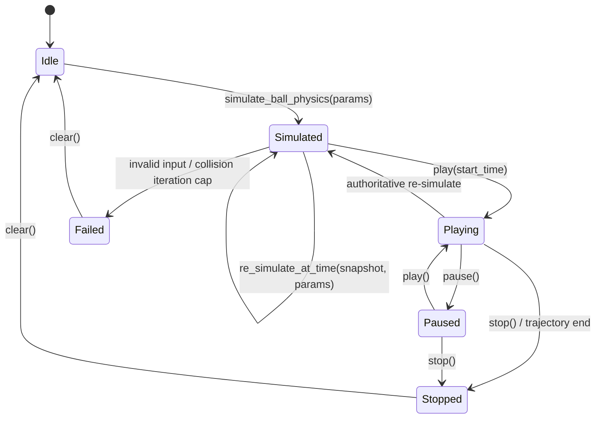
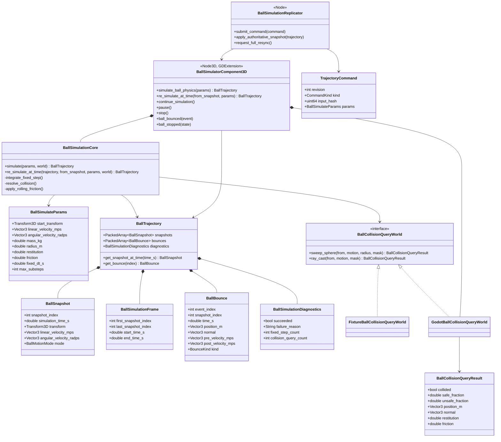
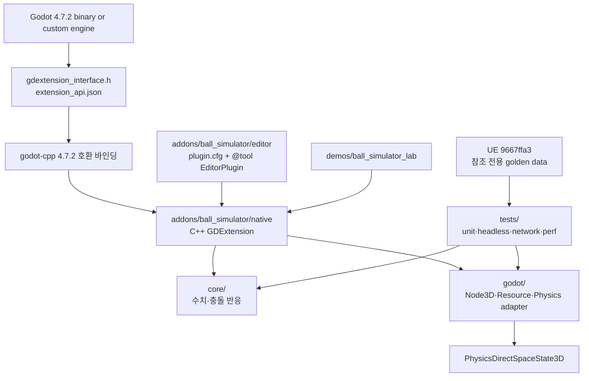
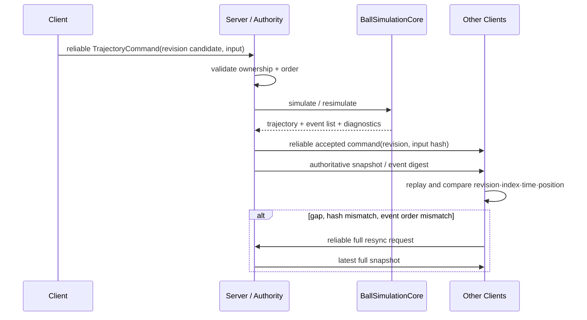

# Godot Ball Simulator GDD

> 상태: **M1 구현 완료, M2 이후 설계안**
> 엔진 기준: Godot `4.7.2-stable` (`ed1daf0b`)
> 원본 동작 기준: Unreal `codex/ball-simulator-example` (`9667ffa3`)
> 범위: 3D 공의 예측형 궤적 시뮬레이션, 바운스 이벤트, 디버그 도구, 서버 권위 동기화

## 1. 제품 의도

`BallSimulator`는 Godot 게임 팀이 스포츠·당구형 공의 **미리 계산된 궤적**을 만들고, 발사·회전·마찰·반발·표면을 조절하며, 바운스 순서와 위치를 검증할 수 있게 하는 네이티브 플러그인이다.

플레이어에게 직접 노출되는 기능은 공의 예측 가능한 움직임과 일관된 충돌 피드백이다. 개발자에게 직접 노출되는 기능은 파라미터 프리셋, 궤적/바운스 시각화, 재현 가능한 리포트, 멀티플레이 불일치 진단이다.

### 성공 가설

- 게임플레이 코드는 `BallSimulatorComponent3D`에 입력을 한 번 전달해 궤적과 이벤트를 얻는다.
- 서버와 클라이언트는 같은 명령 세대와 동일한 고정 월드를 기준으로 바운스 순서·snapshot index·시간·위치를 비교할 수 있다.
- 물리 수식 회귀, Godot 충돌 질의 차이, 네트워크 전달 문제는 로그와 테스트 결과에서 서로 구분된다.

### 비목표

- Godot의 기본 `RigidBody3D`를 대체하거나 엔진 전체 PhysicsServer3D solver를 수정하지 않는다.
- 모든 플랫폼·모든 복잡한 메시 collider에서 bit-exact 결과를 약속하지 않는다.
- UE의 `UObject`, Blueprint, replication 타입이나 원본의 생성 산출물을 이식하지 않는다.
- 폐기 이력이 있는 dynamic-collision re-simulation은 1차 릴리스에 포함하지 않는다.

## 2. 확장 방식 결정

### 기본안 — GDExtension + 선택적 EditorPlugin

런타임 수치 코어와 `BallSimulatorComponent3D`는 `godot-cpp` 기반 **GDExtension**으로 제공한다. GDExtension은 엔진을 재컴파일하지 않고 런타임 공유 라이브러리를 로드해 네이티브 클래스를 등록하는 Godot 공식 확장 방식이다.

`plugin.cfg`와 `@tool` `EditorPlugin`은 선택적 에디터 도구다. 파라미터 프리셋, 궤적 미리보기, 테스트 실행 버튼은 여기에서 제공하되, 물리 수식과 결과 생성은 GDExtension 안에 둔다.

이 선택의 결과:

- 표준 Godot 4.7.2 설치본에서도 배포·업데이트할 수 있다.
- 게임 프로젝트의 `addons/ball_simulator`에 설치할 수 있다.
- 엔진 fork인 `D:\Github\godot-engine`은 API 조사와 모듈 승격 실험에만 사용하고, MVP 배포물의 필수 의존성으로 만들지 않는다.

### 승격안 — custom C++ module

다음 중 하나가 실제로 입증될 때만 `modules/ball_simulator` custom module로 승격한다.

- GDExtension에 노출되지 않은 PhysicsServer3D 내부 solver hook이 필수다.
- 모든 물리 step 앞/뒤에 전역적으로 개입해야 한다.
- extension ABI로는 충족할 수 없는 서버 구현 또는 엔진 내부 타입 접근이 필요하다.

승격 시에도 Godot 원본 파일을 바로 수정하지 않는다. `custom_modules` SCons 옵션으로 외부 모듈 경로를 먼저 빌드하고, 엔진 fork에 병합할 변경은 독립 커밋으로 유지한다. 이 경로는 사용자에게 커스텀 엔진 바이너리를 요구하므로 배포 범위를 명시적으로 좁힌다.

## 3. 검증된 Godot 엔진 구조

Godot `4.7.2-stable`의 `main/main.cpp`은 core → servers → scene → editor 초기화 레벨에서 모듈을 초기화하고, 각 레벨에서 `GDExtensionManager`가 extension을 초기화한다. `core/extension/`에는 extension API JSON, 공유 라이브러리 loader, manager가 있으며, editor 확장 기본 클래스는 `editor/plugins/editor_plugin.h`에 있다.

```mermaid
flowchart TB
    Main[main/main.cpp\n부팅·종료 순서] --> Core[core/\nObject·ClassDB·Resource·GDExtensionManager]
    Core --> Servers[servers/\nRendering·Audio·PhysicsServer3D]
    Servers --> Scene[scene/\nNode·Node3D·World3D·PhysicsDirectSpaceState3D]
    Scene --> Editor[editor/\nEditorNode·EditorPlugin]

    Modules[modules/\n내장·custom C++ modules] -. 초기화 레벨별 등록 .-> Core
    Modules -. 초기화 레벨별 등록 .-> Servers
    Modules -. 초기화 레벨별 등록 .-> Scene
    Modules -. 도구 빌드에서 등록 .-> Editor

    ExtensionManager[GDExtensionManager\ncore/extension/] --> RuntimeExtension[Ball Simulator\nGDExtension 공유 라이브러리]
    RuntimeExtension --> Scene
    EditorPlugin[addons/ball_simulator\n@tool EditorPlugin] --> Editor
    EditorPlugin --> RuntimeExtension
```

엔진 구조에서 Ball Simulator가 직접 의존하는 공개 경계는 `Node3D`, `Resource`, `PhysicsDirectSpaceState3D`, `MultiplayerAPI`, `ClassDB`다. 수치 코어는 이 경계 안쪽의 `core/`, `servers/`, `scene/` 구현체에 직접 의존하지 않는다.

### CollisionWorld 격리와 1-way 질의 정책

Ball Simulator는 Godot의 CollisionWorld를 소유하거나 변경하지 않는 독립 수치 시뮬레이터다. Godot 어댑터 `GodotBallCollisionQueryWorld`는 physics process 중 `PhysicsDirectSpaceState3D`를 통해 아래의 **읽기 전용 결과만 복사**해 `BallCollisionQueryWorld`에 반환한다.

- 공의 연속 충돌에는 분리된 sphere shape의 `cast_motion`을 우선 사용한다. 고속 공은 반지름이 0인 ray만으로 처리하지 않는다.
- `intersect_ray`는 조준선·센서·표면 확인처럼 선분이면 충분한 보조 질의에만 사용한다.
- `intersect_shape`/`get_rest_info`는 정적 접촉의 추가 정보가 필요할 때에만 사용하며, 결과에 Godot `Object`/`RID` 포인터를 보관하지 않는다.
- `RigidBody3D`, `CharacterBody3D`, `Area3D` 또는 `PhysicsServer3D` body를 생성하지 않는다. 기존 body의 transform, velocity, force/impulse, collision layer/mask를 바꾸지 않고 callback도 등록하지 않는다.

따라서 공의 적분, 반발, 마찰, 스핀, rolling, snapshot과 bounce 이벤트는 모두 코어가 계산한다. M2의 통합 테스트는 질의 전후 Godot body의 RID·transform·velocity·layer/mask가 바뀌지 않았음을 검사한다.

## 4. 사용자 흐름과 데이터 흐름

### 개발자 흐름

1. 디자이너가 `BallSimulateParams` 또는 프리셋을 선택한다.
2. 게임 코드가 `simulate_ball_physics()` 또는 `re_simulate_at_time()` 명령을 서버에 전달한다.
3. 서버가 입력을 검증하고 revision을 증가시킨 후, 고정 step 궤적을 계산한다.
4. 코어는 충돌 월드에서 sweep 결과를 받아 snapshot과 bounce event를 생성한다.
5. 런타임은 궤적을 재생하고, 에디터는 같은 데이터를 디버그 뷰로 표시한다.
6. 멀티플레이에서는 명령, revision, 입력 hash, 서버 snapshot을 비교한다. 차이가 있으면 진단 후 full snapshot으로 복구한다.

```mermaid
flowchart LR
    Author[디자이너 / 게임 코드] --> Params[BallSimulateParams\n미터·초·kg·rad/s]
    Params --> Command[TrajectoryCommand\nkind·revision·input_hash]
    Command --> Authority[BallSimulationReplicator\n서버 권위·명령 검증]
    Authority --> Core[BallSimulationCore\n고정 dt 수치 적분]
    Core --> Query[BallCollisionQueryWorld\nobserver-only sphere sweep / ray]
    Query --> GodotWorld[GodotBallCollisionQueryWorld\nPhysicsDirectSpaceState3D read-only]
    GodotWorld --> Core
    Core --> Output[BallTrajectory\nBallSnapshot[] + BallBounce[]]
    Output --> Playback[BallSimulatorComponent3D\nNode3D 재생·신호]
    Output --> Debug[EditorPlugin / Lab\n궤적·이벤트 시각화]
    Output --> Report[헤드리스 테스트\nJSON·Markdown 결과]
    Authority --> Client[클라이언트\nrevision·hash·event 비교]
    Client -->|gap 또는 불일치| Authority
```

### 시뮬레이션 상태 흐름



`simulate_ball_physics`, `re_simulate_at_time`, `play`, `pause`, `stop`은 매 프레임 상태 복제가 아닌 순서가 보장돼야 하는 명령이다. 서버는 명령을 reliable로 전달하고, 최신 결과 스냅샷은 late join과 gap 복구용으로 별도 전송한다.

## 5. 클래스와 구조체 설계



### 데이터 계약

- 공개 단위는 `m`, `s`, `kg`, `rad/s`다. UE 기준 데이터는 API 경계의 변환 함수로만 `cm → m`, `Z-up → Y-up`을 적용한다.
- 모든 `BallSnapshot`과 `BallBounce`에는 단조 증가하는 snapshot/event index와 simulation time을 기록한다.
- `BallTrajectory`는 결과값이며, 충돌 월드 Object 참조·네트워크 소켓·Node 포인터를 보유하지 않는다.
- `SimulationDiagnostics`는 정상 결과에도 남는다. iteration 상한, 최대 관통, 입력 hash, 고정 step 수를 보고해 false alarm을 줄인다.

## 6. 의존성과 프로젝트 배치



권장 배치:

```text
addons/ball_simulator/
  ball_simulator.gdextension
  native/
    src/core/                 # Godot 비의존 C++
    src/godot/                # GDExtension 바인딩·physics adapter
    tests/                    # 코어 unit test
    SConstruct or CMakeLists.txt
  editor/
    plugin.cfg
    ball_simulator_editor_plugin.gd
  scripts/
    ball_simulator_facade.gd
demos/ball_simulator_lab/
tests/
  fixtures/
  integration/
  multiplayer/
  performance/
docs/
```

## 7. 기능 요구와 튜닝 가능 항목

### MVP 기능

- 중력, 초기 선속도, 각속도/회전축, 질량, 반지름, 마찰, 반발 계수
- 고정 time step과 swept-sphere 기반 연속 충돌
- 벽·바닥·홀 collider, 다중 바운스, slide/rolling 전환
- 시점별 상태·다음/이전 바운스 조회, 궤적 재계산
- `ball_bounced`, `ball_entered_hole`, `ball_stopped` 신호
- 헤드리스 리포트와 에디터 내 궤적·바운스 디버그 표시

### 튜닝 노출

- fixed dt, 최대 substep/충돌 반복 횟수, epsilon, sleep/stop threshold
- 표면별 마찰·반발 계수와 hole 판정
- 공의 mass/radius/inertia, rolling friction, angular damping
- collision layer/mask와 self/trigger 제외 규칙

튜닝 값은 코드 상수가 아니라 `BallSimulateParams`/`SurfaceMaterial` resource로 노출한다. 값 범위는 원본 골든 데이터와 Godot 실측 후 정하며, 현재 값은 제안이지 검증된 밸런스가 아니다.

## 8. 멀티플레이 규칙



- 서버만 최종 궤적을 권위 있게 만든다.
- 클라이언트 예측은 허용하지만, 동일 revision의 동일 input hash와 event ordering을 확인해야 한다.
- 경고 시간 차이는 0.20~0.50초, 실패 시간 차이는 0.50초 초과를 기본값으로 둔다.
- 시간 차이가 작아도 방향, 위치, bounce count, event order, snapshot index가 다르면 실패다.
- 2인 검증을 통과한 뒤 6인 순차 난입과 최대 3인 소유권 경합을 추가한다.

## 9. 검증·성능·플레이어 피드백

### 필수 검증

- 충돌 없는 포물선, 단일 벽 반사, rolling, hole 진입, 반복 바운스
- 야구·축구·골프·배구·핸드볼 파라미터 매트릭스
- 0.01/0.05/0.10m 벽, 30/60Hz, 10초, 30/100/200km/h 발사
- 2인 서버/클라이언트의 bounce snapshot index·time·position 비교
- 정상, 100ms/5%, 250ms/15% 테스트 전송 조건

### 성능 규칙

- 128개 공 batch 계산은 warm-up 후 중앙값·p95·allocation을 기록한다.
- 최소 지원 하드웨어 예산은 구현 전 숫자로 약속하지 않는다. Windows Debug/Release, CPU, renderer, collision world, 공 수를 기록한 비교 가능한 기준선을 먼저 만든다.
- 성능 초과 시 이벤트 기록 빈도, debug draw, snapshot 보존 길이를 먼저 조절하되, 충돌 순서·서버 권위는 낮추지 않는다.

### 개발자 피드백

- EditorPlugin은 현재 state, 다음 bounce, event index, 시간·위치 차이, revision/hash, 최대 관통을 표시한다.
- 테스트 실패 파일은 입력 파라미터, random seed, 엔진/플러그인 버전, event index, 서버/클라이언트 값을 모두 남긴다.
- 실제 플레이 감각(예: 공이 자연스럽다)은 자동 테스트 통과만으로 주장하지 않는다. 대표 스포츠별 플레이테스트로 별도 평가한다.

## 10. 구현 순서와 결정 게이트

1. **기반:** Godot 4.7.2과 호환되는 GDExtension 빌드, 최소 `BallSnapshot`/`BallSimulateParams`, 헤드리스 smoke test.
2. **수치 코어:** 충돌 없는 탄도와 단위/좌표 변환. 원본 fixture와 비교.
3. **정적 충돌:** swept sphere, 반발·마찰·스핀·rolling, 고정 월드 및 다중 바운스.
4. **Godot 연결:** `PhysicsDirectSpaceState3D` adapter, Node3D, signals, 데모/에디터 디버그.
5. **동기화:** 2인 authoritative command/snapshot 검증, 지연·손실 주입.
6. **확장:** 6인, 경합, 프로파일, 패키지별 사전 빌드.

GDExtension으로 4단계까지 통과하면 엔진 fork는 수정하지 않는다. 4단계에서 공개 API가 실제로 부족하다는 재현 가능한 증거가 생길 때만 custom module spike를 시작한다.

## 11. 조사 근거

- [GDExtension system](https://docs.godotengine.org/en/stable/engine_details/engine_api/gdextension/index.html): 엔진 재컴파일 없이 네이티브 공유 라이브러리를 로드하는 확장 방식.
- [godot-cpp](https://docs.godotengine.org/en/stable/tutorials/scripting/cpp/about_godot_cpp.html): 공식 C++ GDExtension 바인딩과 module 대비 배포 장단점.
- [Custom modules and build system](https://docs.godotengine.org/en/stable/engine_details/development/compiling/introduction_to_the_buildsystem.html): `custom_modules` SCons 옵션과 custom module의 빌드 경계.
- [Making editor plugins](https://docs.godotengine.org/en/stable/tutorials/plugins/editor/making_plugins.html): `plugin.cfg`, `@tool`, `EditorPlugin` 수명주기.
- 로컬 Godot `4.7.2-stable` 소스: `main/main.cpp`, `core/extension/`, `editor/plugins/editor_plugin.h`, `scene/`, `servers/`.
- 원본 Unreal `9667ffa3` 소스/테스트: `UNREAL_SOURCE_PORTING_INVENTORY.ko.md`.
